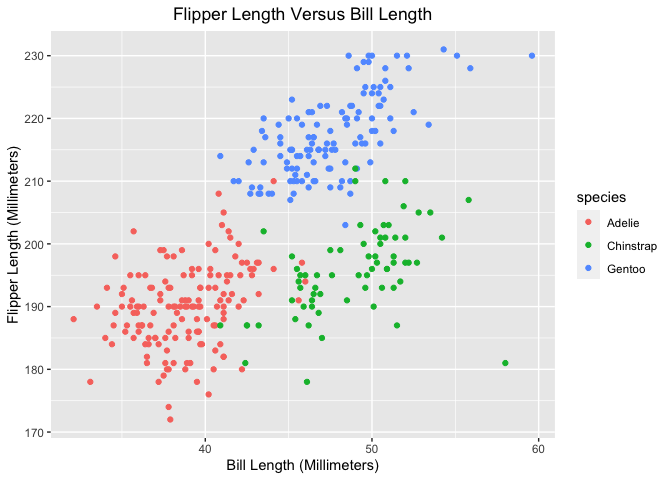

P8105: Data Science I
================
Assignment 1<br>Jimmy Kelliher (UNI: jmk2303)

-   [Problem 1](#problem-1)
-   [Problem 2](#problem-2)

<!------------------------------------------------------------------------------------------
Preamble
------------------------------------------------------------------------------------------->
<!------------------------------------------------------------------------------------------
Problem 1
------------------------------------------------------------------------------------------->

# Problem 1

We begin by constructing a data frame consisting of a numeric vector, a
logical vector, a character vector, and a factor vector, each consisting
of ten elements.

``` r
# set a seed for reproducibility
set.seed(8105)

# create a data frame
dataTypes <- tibble(
    numVar = rnorm(10)      # numeric vector of ten iid draws from N(0, 1)
  , logVar = numVar > 0     # logical vector indicating if numvar is positive
  , strVar = letters[1:10]  # string vector of first ten letters of the alphabet
  , facVar = factor(sample( # factor vector with levels in  {"my", "factor", "variable"}
        x       = c("my", "factor", "variable")
      , size    = 10
      , replace = TRUE
  ))
)

# output data frame
dataTypes
```

    ## # A tibble: 10 x 4
    ##     numVar logVar strVar facVar  
    ##      <dbl> <lgl>  <chr>  <fct>   
    ##  1  0.674  TRUE   a      my      
    ##  2  1.31   TRUE   b      my      
    ##  3  0.115  TRUE   c      my      
    ##  4  1.07   TRUE   d      variable
    ##  5  0.155  TRUE   e      variable
    ##  6  2.12   TRUE   f      my      
    ##  7 -0.219  FALSE  g      factor  
    ##  8 -0.113  FALSE  h      my      
    ##  9 -0.0651 FALSE  i      my      
    ## 10  0.476  TRUE   j      factor

Now we will attempt to compute the mean of each column of our data
frame. Let’s begin with the numeric vector.

``` r
# attempt to compute mean of numerical vector
mean(pull(dataTypes, numVar))
```

    ## [1] 0.5520184

We obtain a mean of about 0.55. This result is very straightforward! We
will now attempt to compute the mean of our logical vector.

``` r
# attempt to compute mean of logical vector
mean(pull(dataTypes, logVar))
```

    ## [1] 0.7

That worked, as well! While values in our logical vector are Boolean, R
coerces values via the map FALSE ↦ 0 and TRUE ↦ 1. When taking the mean
of such a vector, then, we are computing the fraction of elements in our
vector for which our logical statement evaluates to TRUE. In our case,
we recover the fraction of elements in our numeric vector that are
positive. Things are looking up! We will now attempt to compute the mean
of our character vector.

``` r
# attempt to compute mean of character vector
mean(pull(dataTypes, strVar))
```

    ## Warning in mean.default(pull(dataTypes, strVar)): argument is not numeric or
    ## logical: returning NA

    ## [1] NA

*Oh no!* Our luck has run out, it seems. While there is a very natural
coercion from a Boolean variable to a binary numeric variable, the data
in our character vector does not even have a meaningful ordering. As
such, R returns a value of NA along with a warning message. We
pessimistically proceed with our factor vector.

``` r
# attempt to compute mean of factor vector
mean(pull(dataTypes, facVar))
```

    ## Warning in mean.default(pull(dataTypes, facVar)): argument is not numeric or
    ## logical: returning NA

    ## [1] NA

Again, R is unable to coerce the data into anything that might
meaningfully allow us to compute a mean. Where did we go wrong? Let’s
try to coerce each of our non-numeric vectors manually.

``` r
# experiment with coercing data types to numeric
as.numeric(pull(dataTypes, logVar))
as.numeric(pull(dataTypes, strVar))
as.numeric(pull(dataTypes, facVar))
```

As mentioned earlier, coercion of our Boolean vector is straightforward.
Our factor vector can also be coerced according to the map
factor<sub>*k*</sub> ↦ *k*, where factor<sub>*k*</sub> denotes the *k*th
factor level of our vector. R refuses to implement this coercion in
computing means because the order of factors is arbitrary, though this
manner of coercion can be useful in linear regression models with fixed
effects, for example. However, because elements of our character vector
contain non-numeric characters, coercion to a numeric vector is
impossible. In this instance, we are given a vector of NAs as pittance.
That said, there do exist character for which coercion *is* possible.

``` r
# example of character vector that can be coerced to a numeric one
as.numeric(c("1", "2", "3"))
```

    ## [1] 1 2 3

Because each element in the above character vector is comprised solely
of numeric characters, coercion is possible. This is a very useful
feature, as many data providers will store numeric data as strings;
conversion back to numeric data, when safe to do, can reduce file size
substantially.

<!------------------------------------------------------------------------------------------
Problem 2
------------------------------------------------------------------------------------------->

# Problem 2

``` r
# load in the penguins dataset
data("penguins", package = "palmerpenguins")

# view the first few rows of the data
head(penguins)
```

    ## # A tibble: 6 x 8
    ##   species island bill_length_mm bill_depth_mm flipper_length_… body_mass_g sex  
    ##   <fct>   <fct>           <dbl>         <dbl>            <int>       <int> <fct>
    ## 1 Adelie  Torge…           39.1          18.7              181        3750 male 
    ## 2 Adelie  Torge…           39.5          17.4              186        3800 fema…
    ## 3 Adelie  Torge…           40.3          18                195        3250 fema…
    ## 4 Adelie  Torge…           NA            NA                 NA          NA <NA> 
    ## 5 Adelie  Torge…           36.7          19.3              193        3450 fema…
    ## 6 Adelie  Torge…           39.3          20.6              190        3650 male 
    ## # … with 1 more variable: year <int>

``` r
# report summary statistics of the data
summary(penguins)
```

    ##       species          island    bill_length_mm  bill_depth_mm  
    ##  Adelie   :152   Biscoe   :168   Min.   :32.10   Min.   :13.10  
    ##  Chinstrap: 68   Dream    :124   1st Qu.:39.23   1st Qu.:15.60  
    ##  Gentoo   :124   Torgersen: 52   Median :44.45   Median :17.30  
    ##                                  Mean   :43.92   Mean   :17.15  
    ##                                  3rd Qu.:48.50   3rd Qu.:18.70  
    ##                                  Max.   :59.60   Max.   :21.50  
    ##                                  NA's   :2       NA's   :2      
    ##  flipper_length_mm  body_mass_g       sex           year     
    ##  Min.   :172.0     Min.   :2700   female:165   Min.   :2007  
    ##  1st Qu.:190.0     1st Qu.:3550   male  :168   1st Qu.:2007  
    ##  Median :197.0     Median :4050   NA's  : 11   Median :2008  
    ##  Mean   :200.9     Mean   :4202                Mean   :2008  
    ##  3rd Qu.:213.0     3rd Qu.:4750                3rd Qu.:2009  
    ##  Max.   :231.0     Max.   :6300                Max.   :2009  
    ##  NA's   :2         NA's   :2

The penguins dataset consists of 344 rows and 8 columns. The column
names of the dataset are (species, island, bill\_length\_mm,
bill\_depth\_mm, flipper\_length\_mm, body\_mass\_g, sex, year), and the
data are of types (factor, factor, numeric, numeric, integer, integer,
factor, integer), respectively. Upon excluding rows with missing values,
the mean flipper length of penguins in the dataset is 200.92
millimeters. To visualize the correlation between flipper length and
bill length, we construct a scatter plot below.

``` r
# create a scatter plot of flipper length versus bill length, by species
ggplot(
    data = penguins 
  , aes(
        x     = bill_length_mm    # x variable is bill length
      , y     = flipper_length_mm # y variable is flipper length
      , color = species           # assign each level of species a color
    )
) +
  # instantiate scatter plot
  geom_point() +
  # add metadata
  labs(
      title = "Flipper Length Versus Bill Length"
    , x     = "Bill Length (Millimeters)"
    , y     = "Flipper Length (Millimeters)"
  ) +
  # center the title of the graph
  theme(plot.title = element_text(hjust = 0.5))
```

<!-- -->

``` r
# save the scatter plot
ggsave("flipper_vs_bill_scatter.png")
```
